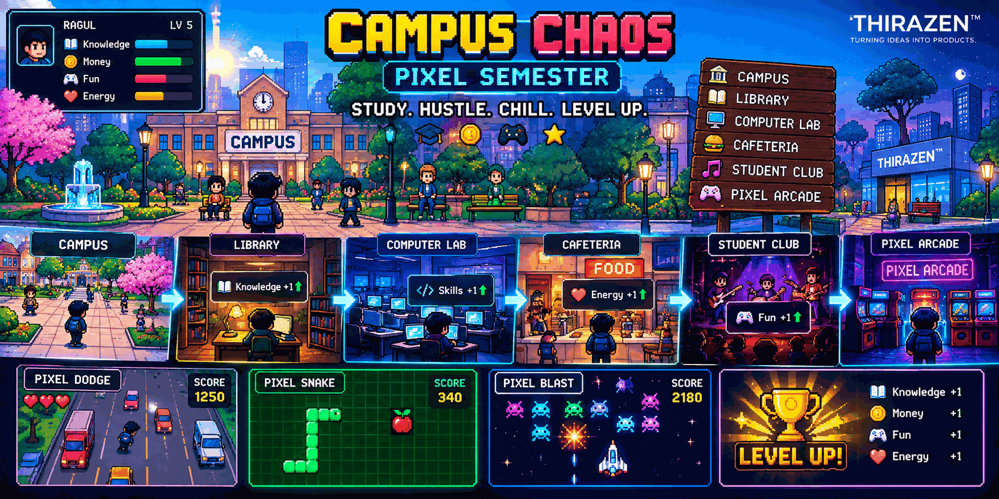

<div align="center">

# 🎮 Campus Chaos: Pixel Semester



### **Study. Hustle. Chill. Level Up.**

**A pixel-inspired student-life browser game by THIRAZEN™**

[▶️ Play the Game](https://ragul-ai-netron.github.io/Campus-chaos-pixel-semester/)

</div>

---

## 🏫 About

**Campus Chaos: Pixel Semester** is a browser-based student-life game where you balance **Knowledge, Money, Fun, and Energy** while exploring campus, completing challenges, upgrading your setup, and playing arcade mini-games.

Built as a lightweight web game with **HTML, CSS, and JavaScript** — no external game engine required.

---

## ✨ Features

### 🏫 Interactive Campus

Explore four campus locations:

- 📚 **Library** — study and complete the memory challenge
- 🍔 **Cafeteria** — buy meals and snacks to restore Energy
- 🎸 **Student Club** — take part in fun activities
- 🧪 **Computer Lab** — complete a coding-style challenge

### 📊 Student-Life Systems

Manage four core resources:

| Resource | Purpose |
|---|---|
| 📚 Knowledge | Academic progress |
| 💰 Money | Purchases and upgrades |
| 😎 Fun | Activities and entertainment |
| ❤️ Energy | Limits your daily actions |

Also includes:

- ⭐ XP and level progression
- ⬆️ Upgrades
- 🎯 Quests
- 💾 Local save system
- 🔄 New Semester system
- 🔊 Built-in sound effects
- 🔇 Sound ON/OFF setting

---

# 📱 PIXEL ARCADE

Open the **Student Phone** to enter the arcade.

### 🚗 Pixel Dodge

Move left and right to avoid incoming obstacles.

**PC:** `A / D` or `← / →`

**Mobile:** use the on-screen controls.

---

### 🐍 Pixel Snake

Collect food and grow the snake.

**PC:** `WASD` or arrow keys

**Mobile:** use the on-screen D-pad.

The game uses wrap-around edges, so reaching an edge does not immediately end the run.

---

### 👾 Pixel Blast

Hit the moving target before time runs out.

**PC:** mouse / pointer

**Mobile:** touch the target or use the on-screen action control.

---

## 🏆 Victory Screens

Winning challenges and arcade games produces dedicated victory screens with:

- 🎉 Congratulations message
- 🏆 Game-specific title
- 💰 / ⭐ Rewards
- ▶️ Play Next Game
- 🔄 Play Again

---

# 🎨 Design

The game uses a **neo-brutalist / pixel-arcade visual style** designed to work across desktop and mobile screens.

The interface includes:

- Responsive layouts
- High-contrast game panels
- Pixel-inspired controls
- Touch-friendly buttons
- Keyboard controls
- Animated feedback
- Built-in browser audio

---

# 🛠️ Tech Stack

- **HTML5**
- **CSS3**
- **Vanilla JavaScript**
- **Web Audio API**
- **LocalStorage**
- **GitHub Pages**

No framework or external game engine is required.

---

# 🚀 Run Locally

Clone the repository:

```bash
git clone https://github.com/Ragul-ai-netron/Campus-chaos-pixel-semester.git
cd Campus-chaos-pixel-semester
```

Then open `index.html` in a browser.

For the best experience, use a local/static web server or GitHub Pages.

---

# 🌐 GitHub Pages

This project is designed to run directly from GitHub Pages.

### Setup

1. Open the repository on GitHub.
2. Go to **Settings → Pages**.
3. Select **Deploy from a branch**.
4. Choose the `main` branch.
5. Choose `/ (root)`.
6. Click **Save**.
7. Open the generated GitHub Pages URL.

### Live Game

**[🎮 Play Campus Chaos: Pixel Semester](https://ragul-ai-netron.github.io/Campus-chaos-pixel-semester/)**

---

# 📁 Project Structure

```text
Campus-chaos-pixel-semester/
├── index.html
├── README.md
└── .gitignore
```

The game is intentionally kept lightweight and portable.

---

# 🎮 Controls

| Platform | Controls |
|---|---|
| 🖥️ Desktop | Mouse + keyboard |
| 📱 Mobile | Touch controls |
| 🚗 Dodge | A/D or ←/→ |
| 🐍 Snake | WASD or arrow keys |
| 👾 Blast | Mouse / touch |

---

# 💾 Save System

Game progress is stored locally in the browser using **LocalStorage**.

This means your progress is saved on your device/browser rather than through a remote account system.

Clearing browser storage can remove the saved game.

---

# 🧑‍💻 Developer

**Ragul // AI Engineer**

Building practical AI systems, interactive products, and experiments.

### Brand

**THIRAZEN™**

*Turning ideas into products.*

---

# 📌 Project Philosophy

> **Build → Break → Fix → Ship**

Campus Chaos started as a student-life game concept and evolved into a playable browser experience with its own progression systems, mini-games, responsive controls, sound, and save system.

---

<div align="center">

### ⚡ BUILD • BREAK • FIX • SHIP ⚡

**THIRAZEN™**

</div>
